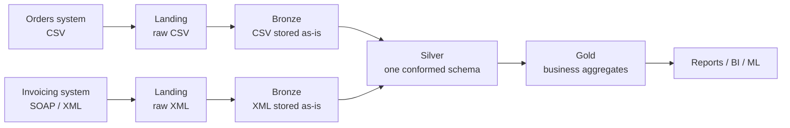
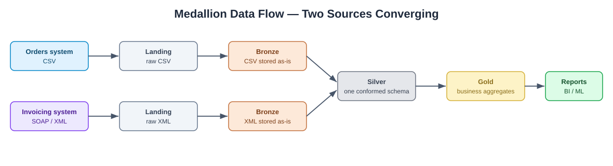

# 01 — Overview

## Goal

Give data-engineering students a small, fully runnable example of how raw data
becomes trustworthy, business-ready data in a data lake — using the widely
adopted **medallion architecture**.

The whole thing runs with native Python (standard library only), so students can
focus on the *concepts* instead of fighting with Spark clusters, cloud accounts,
or dependency installs.

## Audience

- Students in an introductory data-engineering class.
- Anyone who wants a mental model of bronze/silver/gold before touching a real
  platform (Databricks, Microsoft Fabric, Snowflake, etc.).

## The medallion architecture

Data is refined in layers. Each layer has a clear, single responsibility, and
data only ever flows **downstream** (raw → refined). Crucially, the pattern is
**format-agnostic** and supports **many source systems at once** — they each keep
their native format in bronze and *converge* into one shared schema at silver.

This simulation ships with **two source systems on purpose**:

- an **orders** system that emits **CSV**, and
- an **invoicing/payment** system (a SOAP middleware) that emits **XML**.

Seeing a CSV feed and an XML feed land in the *same* clean silver table is the
headline lesson: bronze/silver/gold does not care about file format.

| Layer | Nickname | Responsibility | Data quality |
| --- | --- | --- | --- |
| **Bronze** | Raw / staging | Store source data exactly as received, plus ingestion metadata. Never lose the original. | Low (messy) |
| **Silver** | Cleansed / conformed | Clean, type, deduplicate, and validate. Standard schema everyone can trust. | Medium/High |
| **Gold** | Curated / business | Aggregate and model for a specific business question. | High (ready to use) |

## Why layers?

- **Reproducibility** — if cleaning logic changes, you can rebuild silver/gold
  from the untouched bronze copy.
- **Debuggability** — when a number looks wrong, you can trace it back layer by
  layer to the exact raw record.
- **Separation of concerns** — ingestion, quality, and business logic live in
  different places instead of one giant script.
- **Source integration** — heterogeneous systems (CSV, XML/SOAP, JSON, APIs) are
  reconciled once, at silver, into a vocabulary the whole business shares.

## What this simulation is (and isn't)

- **Is:** a faithful conceptual model of the layers and their transformations.
- **Isn't:** a scalable engine. It reads whole CSVs into memory and is meant for
  small teaching datasets, not production volumes.

---

**Contact:** George Gergues
