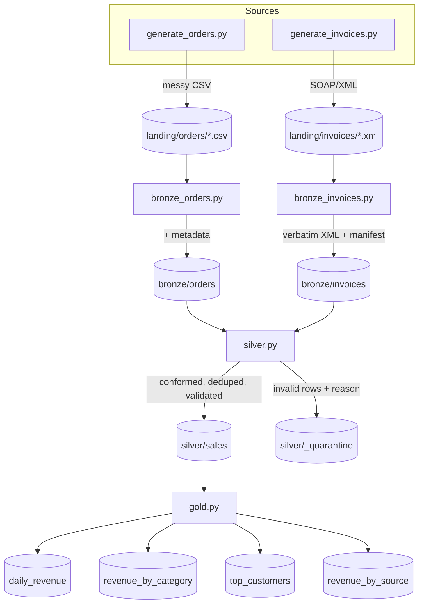
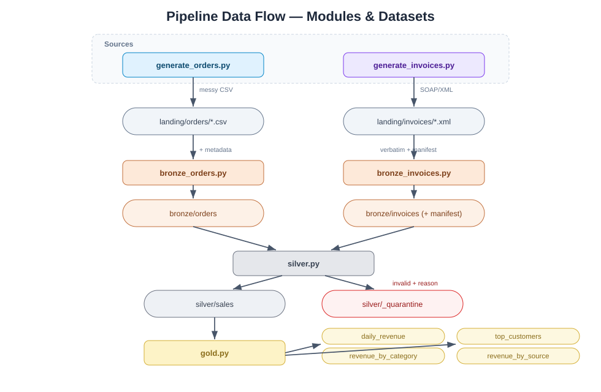

# 02 — Architecture

## Two source systems, one lake

| Source system | Protocol / format | Lands as | Example record |
| --- | --- | --- | --- |
| **Orders** | flat file export | CSV | one product line per row |
| **Invoicing / payments** | SOAP middleware | XML | a SOAP envelope with an invoice + line items |

Both are messy in their own way, and both flow through the **same** medallion
layers. They only *look* different until silver, where they converge.

## Project layout

```
lake-simulation/
├── run.py                    # CLI orchestrator (argparse)
├── requirements.txt          # stdlib only — documents "no installs"
├── README.md                 # quick start
├── architecture/             # these design docs
├── src/
│   ├── common.py             # shared helpers: paths, CSV I/O, logging, metadata
│   ├── generate_orders.py    # synthetic messy CSV   -> landing/orders/
│   ├── generate_invoices.py  # synthetic messy SOAP  -> landing/invoices/
│   ├── bronze_orders.py      # ingest CSV as-is       -> bronze/orders/
│   ├── bronze_invoices.py    # ingest XML as-is       -> bronze/invoices/
│   ├── silver.py             # shred + conform + merge both sources -> silver/sales/
│   └── gold.py               # aggregate              -> gold/
└── data/                     # the "lake" (created at runtime)
    ├── landing/
    │   ├── orders/           # raw *.csv from the orders system
    │   └── invoices/         # raw *.xml SOAP envelopes from invoicing
    ├── bronze/
    │   ├── orders/           # CSV rows + ingestion metadata
    │   └── invoices/         # verbatim XML copies + manifest.csv
    ├── silver/
    │   ├── sales/            # ONE conformed table (both sources merged)
    │   └── _quarantine/      # rejected records + reason (both sources)
    └── gold/                 # daily_revenue, revenue_by_category,
                              # top_customers, revenue_by_source
```

Notice the **per-source subfolders** in landing and bronze (each system keeps its
own raw area and format), and the **single shared folder** at silver — that shape
*is* the lesson.

## Data flow





## Layer responsibilities

### Landing
- Per-source drop zones: `landing/orders/` (CSV), `landing/invoices/` (XML).
- Files are messy on purpose so silver has real work to do.

### Bronze — *preserve, per source, in native format*
- **Orders:** copy CSV rows verbatim into `bronze/orders/`, adding `_ingested_at`,
  `_source_file`, `_batch_id`.
- **Invoices:** copy each **SOAP envelope verbatim** into `bronze/invoices/`
  (raw XML, untouched) and record a `manifest.csv` cataloguing every ingested
  file with the same ingestion metadata.
- Both are append-only. Bronze proves the layer works for *any* payload — rows
  or documents.

### Silver — *shred, conform, merge*
- Reads both bronze areas.
- **Shreds** each SOAP/XML invoice into one row per line item using Python's
  stdlib `xml.etree.ElementTree` (no dependency).
- Maps *both* sources into **one conformed schema** with a `source_system`
  column for lineage (`orders` | `invoicing`).
- Applies identical cleaning, typing, dedupe (by `source_system` + `source_id`),
  and validation rules. Invalid records from either source go to `_quarantine/`
  with a reason.

### Gold — *serve the (unified) business*
- Reads only the trusted, merged `silver/sales/` table.
- Produces aggregates that now span both systems automatically, plus a
  `revenue_by_source.csv` that shows the CSV-vs-XML split.

## Design principles applied here

- **Format-agnostic layers** — the medallion pattern is unchanged by adding an
  XML source; only a new adapter appears at silver.
- **Late integration** — sources stay separate and raw as long as possible, then
  converge once, at silver (schema-on-read).
- **Lineage preserved** — `source_system` (and bronze metadata) let any gold
  number be traced back to the exact CSV row or XML envelope it came from.
- **Fail visible, not silent** — bad data from either source is quarantined and
  counted, never dropped.

---

**Contact:** George Gergues
