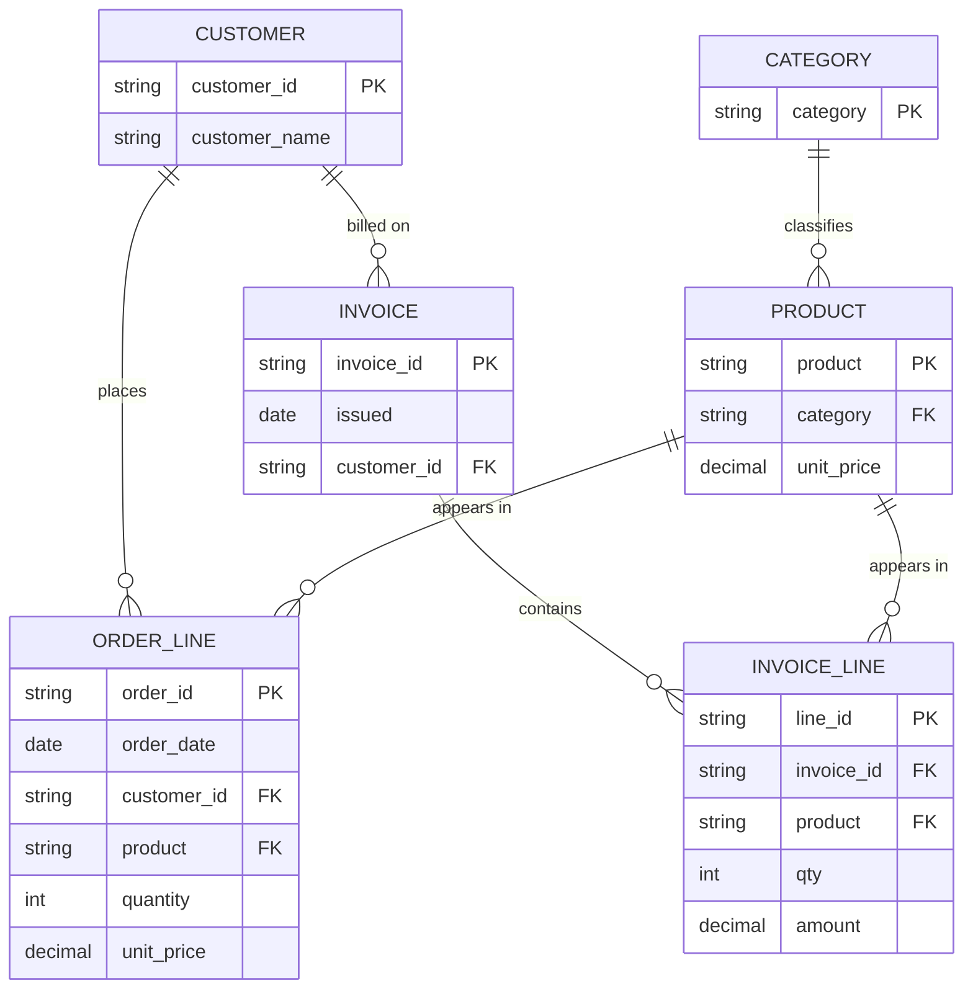
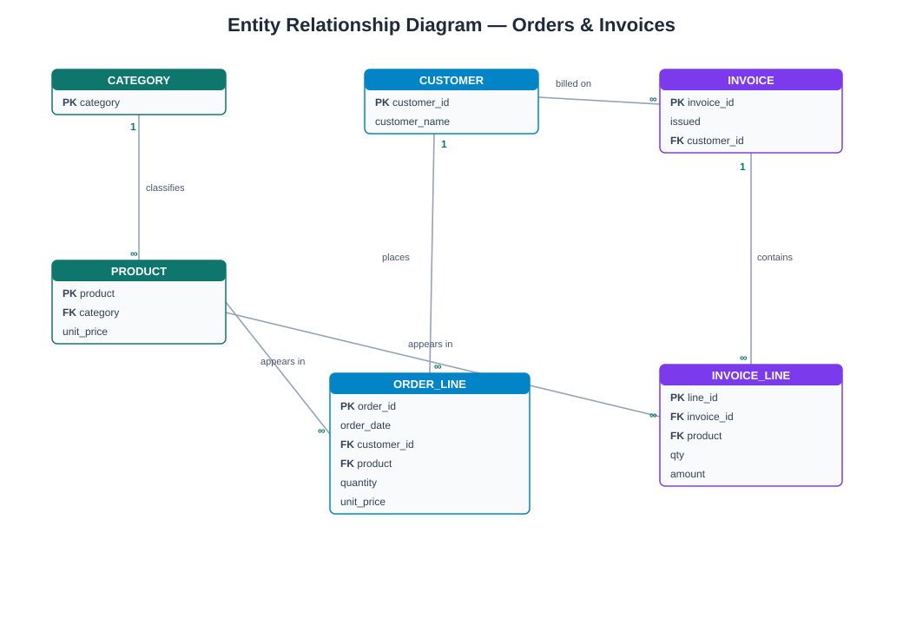

# 03 — Data Model & Data Dictionary

The business domain is **sales activity**, arriving from two systems:

- **Orders** system → flat **CSV**, one product line per row.
- **Invoicing/payment** middleware → **SOAP/XML**, one envelope per invoice with
  nested line items.

Both describe the same thing — a customer bought a quantity of a product at a
price — so silver conforms them into **one shared vocabulary**.

## Natural keys & lineage

| Concept | Orders | Invoicing |
| --- | --- | --- |
| Source system tag | `orders` | `invoicing` |
| Natural key (`source_id`) | `order_id` (e.g. `ORD-1001`) | invoice line id `INV-5001#1` |
| Grain | one order line | one invoice line item |

Duplicates within a source are expected (retries, resends); silver dedupes by
`(source_system, source_id)` keeping the latest ingested version.

## Entity-Relationship Diagram (conceptual)

Both feeds are **denormalized events**. Conceptually they describe the same four
entities; the invoicing side simply nests line items inside an invoice/envelope.





`ORDER_LINE` and `INVOICE_LINE` are two physical shapes of the **same logical
fact**. Silver merges them into the conformed `SALES` table below.

## Landing / Bronze — Orders (CSV, raw)

Bronze = landing columns **plus** the three metadata columns. All text; values
may be missing, mis-cased, or malformed.

| Column | Intended type | Example raw values | Notes |
| --- | --- | --- | --- |
| `order_id` | string | `ORD-1001`, `ord-1001` | Natural key; may duplicate |
| `order_date` | date | `2026-06-01`, `06/01/2026`, `2026-6-1` | Mixed formats |
| `customer_id` | string | `C-42`, ` c-42 ` | Whitespace/casing issues |
| `customer_name` | string | `alice`, `ALICE  ` | Free text |
| `product` | string | `Widget`, `widget` | Free text |
| `category` | string | `Home`, `home`, `` | May be blank |
| `quantity` | integer | `2`, `-1`, `0`, `abc` | Invalid values appear |
| `unit_price` | decimal | `9.99`, `$9.99`, `` | May include currency symbol |
| `_ingested_at` | timestamp | `2026-07-09T10:15:00` | **Bronze only** |
| `_source_file` | string | `orders_2026-06-01.csv` | **Bronze only** |
| `_batch_id` | string | `batch-20260709101500` | **Bronze only** |

## Landing / Bronze — Invoices (SOAP/XML, raw)

Each landing file is one SOAP envelope. Bronze stores the **XML verbatim** and
records a row per file in `bronze/invoices/manifest.csv`.

Example envelope (`landing/invoices/INV-5001.xml`):

```xml
<soap:Envelope xmlns:soap="http://schemas.xmlsoap.org/soap/envelope/"
               xmlns:inv="urn:demo:invoicing">
  <soap:Header>
    <inv:MessageId>MSG-8a1f</inv:MessageId>
  </soap:Header>
  <soap:Body>
    <inv:Invoice id="INV-5001" issued="2026-06-01">
      <inv:Customer code="C-2">Bob</inv:Customer>
      <inv:Lines>
        <inv:Line product="Gadget" category="Electronics">
          <inv:Qty>2</inv:Qty>
          <inv:Amount currency="USD">24.50</inv:Amount>
        </inv:Line>
        <inv:Line product="Widget">           <!-- category attr missing -->
          <inv:Qty>1</inv:Qty>
          <inv:Amount currency="USD">9.99</inv:Amount>
        </inv:Line>
      </inv:Lines>
    </inv:Invoice>
  </soap:Body>
</soap:Envelope>
```

### XML → conformed mapping (done in silver)

| XML location | → Conformed column |
| --- | --- |
| *(constant)* | `source_system = "invoicing"` |
| `Invoice/@id` + line ordinal | `source_id` (e.g. `INV-5001#1`) |
| `Invoice/@issued` | `txn_date` |
| `Customer/@code`, element text | `customer_id`, `customer_name` |
| `Line/@product`, `@category` | `product`, `category` |
| `Line/Qty`, `Line/Amount` | `quantity`, `unit_price` → `revenue` |

### `bronze/invoices/manifest.csv`

| Column | Description |
| --- | --- |
| `_source_file` | XML file name ingested |
| `invoice_id` | Invoice id read from the envelope (catalog aid) |
| `message_id` | SOAP header message id |
| `_ingested_at` | Ingestion timestamp |
| `_batch_id` | Ingestion run id |

## Silver — conformed `silver/sales/sales.csv`

Clean, typed, deduplicated, validated. **One row per line item**, from *either*
source. This is where the two formats become one.

| Column | Type | Rule applied |
| --- | --- | --- |
| `source_system` | string | `orders` or `invoicing` (lineage) |
| `source_id` | string | Natural key within the source; trimmed/upper-cased |
| `txn_date` | date (`YYYY-MM-DD`) | Parsed from any supported input format |
| `customer_id` | string | Upper-cased, trimmed |
| `customer_name` | string | Trimmed, title-cased |
| `product` | string | Trimmed, title-cased |
| `category` | string | Trimmed, title-cased; blank → `Unknown` |
| `quantity` | integer | Must be `> 0` |
| `unit_price` | decimal | Currency symbols stripped; must be `>= 0` |
| `revenue` | decimal | Derived: `quantity * unit_price` |

### Validation rules (fail → quarantine)

A record from **either** source is quarantined (not dropped) if:

1. `source_id` is missing/blank.
2. `txn_date` cannot be parsed.
3. `quantity` is not an integer `> 0`.
4. `unit_price` is not a number `>= 0`.

Quarantined records go to `silver/_quarantine/rejects.csv` with all conformed
raw fields plus `source_system` and a `_reject_reason` column.

## Gold schemas

### `gold/daily_revenue.csv`
| Column | Type | Description |
| --- | --- | --- |
| `txn_date` | date | Day of activity (all sources) |
| `orders` | integer | Line items that day |
| `revenue` | decimal | Sum of `revenue` for the day |

### `gold/revenue_by_category.csv`
| Column | Type | Description |
| --- | --- | --- |
| `category` | string | Product category |
| `units` | integer | Sum of `quantity` |
| `revenue` | decimal | Sum of `revenue` |

### `gold/top_customers.csv`
| Column | Type | Description |
| --- | --- | --- |
| `customer_id` | string | Customer identifier |
| `customer_name` | string | Customer display name |
| `orders` | integer | Number of line items |
| `total_spend` | decimal | Sum of `revenue`, descending |

### `gold/revenue_by_source.csv`  *(new — shows the CSV vs XML split)*
| Column | Type | Description |
| --- | --- | --- |
| `source_system` | string | `orders` or `invoicing` |
| `records` | integer | Line items from that system |
| `revenue` | decimal | Sum of `revenue` from that system |

---

**Contact:** George Gergues
