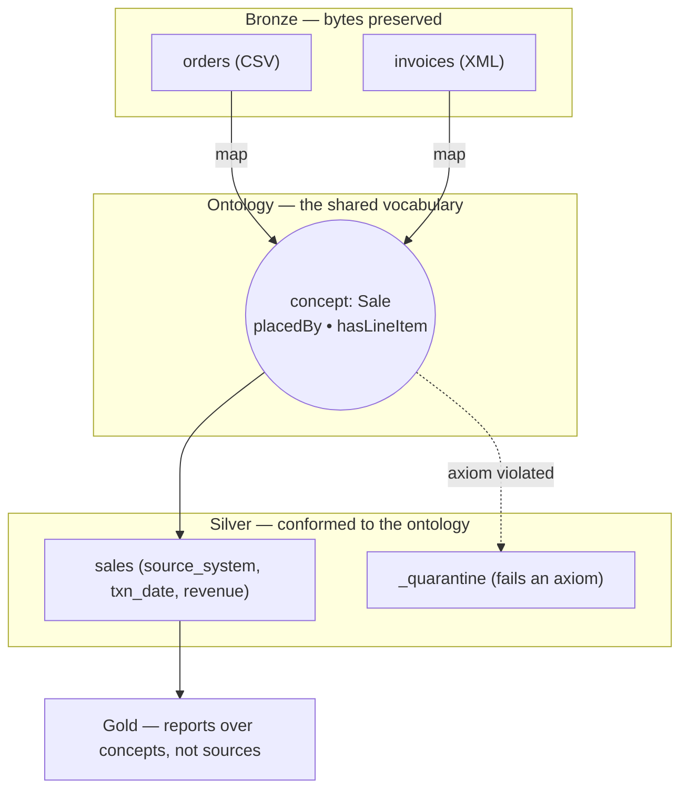
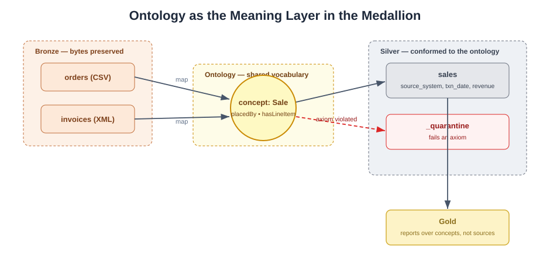

# 06 — Ontology: The Meaning Layer

> **Why this doc exists:** the medallion docs (01–05) explain *how data moves and
> is cleaned*. This one explains *what the data means* and why that meaning —
> the **ontology** — is what makes two very different sources fit into one lake.
> It is an explainability companion, not a new pipeline stage.

For the full teaching narrative, diagrams, glossary, and a formal OWL sketch, see
the [ontology/](../ontology/) folder. This page connects that concept back to the
medallion layers in these docs.

## Schema vs. ontology, in one table

| | Schema / ERD ([03-data-model.md](03-data-model.md)) | Ontology ([ontology/](../ontology/)) |
|---|---|---|
| Question | "How is data *stored*?" | "What does the business *mean*?" |
| Units | tables, columns, keys, types | concepts, relationships, axioms |
| Changes when… | the storage format changes (CSV → XML) | …**it doesn't** — meaning is format-independent |
| Analogy | the filing cabinet | the dictionary + rulebook |

**One-liner for the class:** *an ERD describes tables; an ontology describes the
world the tables are trying to represent.*

## Where the ontology already lives in this pipeline

The class didn't add a new system to get an ontology — they already built one at
the silver layer without naming it. The mapping is exact:

| Ontology idea | Where it already happens in the code |
|---|---|
| Concept **`Sale`** with subclasses `Order`, `Invoice` | `silver.py` unions orders + invoices into one `sales` table |
| **Semantic mapping** (one concept, two source expressions) | `_orders_raw()` and `_invoices_raw()` adapters |
| **Identity** across sources (Customer C007 is one entity) | conformed `customer_id`, dedupe by `(source_system, source_id)` |
| **Axioms** (rules an instance must satisfy) | silver validation → `quantity > 0`, date parses, etc. |
| **Non-conforming instances** | `silver/_quarantine/rejects.csv` with `_reject_reason` |
| **Entailed/derived facts** | `revenue = quantity × unit_price` (stored by neither source) |

## The three things an ontology adds over a schema

1. **Classes & subclasses** — `Order ⊑ Sale`, `Invoice ⊑ Sale`, `Customer ⊑ Party`.
   The subclass link is *why* one gold query can total revenue across both systems.
2. **Named relationships** — `placedBy`, `hasLineItem`, `refersToProduct`,
   `belongsToCategory`, each with a direction and cardinality.
3. **Axioms** — rules that define valid membership (your silver validations),
   plus derivations (revenue).

## Why this matters for the medallion story

- **Bronze** keeps *bytes*. **Silver** conforms *schemas*. The **ontology**
  conforms *meaning*.
- Because gold reports are written against **concepts** (Sale, Customer, Category)
  and not against source tables, a brand-new source can join the lake by adding
  **one mapping** — no change to silver's shape or to any gold report.
- Data quality stops being ad-hoc: it becomes **"does this instance satisfy the
  ontology's axioms?"** Yes → `sales`; No → `_quarantine` with a reason.

## Suggested 10-minute lesson flow

1. Show a CSV order row and an XML invoice line side by side — different shapes.
2. Ask: *"Are these the same kind of thing?"* → introduce the concept **Sale**.
3. Reveal the class diagram ([ontology/README.md](../ontology/README.md)) — both
   are subclasses of `Sale`.
4. Walk the mapping table in
   [ontology/concept-dictionary.md](../ontology/concept-dictionary.md) — one
   concept, two source columns.
5. Reframe silver validation as **axioms**; show `_quarantine` as "instances that
   fail the ontology."
6. Close with the punchline: *agree on concepts, and the storage format stops
   mattering.*

## Related

- [ontology/README.md](../ontology/README.md) — full narrative + diagrams
- [ontology/concept-dictionary.md](../ontology/concept-dictionary.md) — glossary + source mappings
- [ontology/sales-ontology.ttl](../ontology/sales-ontology.ttl) — formal OWL/Turtle sketch
- [03-data-model.md](03-data-model.md) — the *schema* the ontology sits above
- [../sql-pseudocode/03_silver_sales.sql](../sql-pseudocode/03_silver_sales.sql) — the conformance step in pseudo-SQL

---

**Contact:** George Gergues
