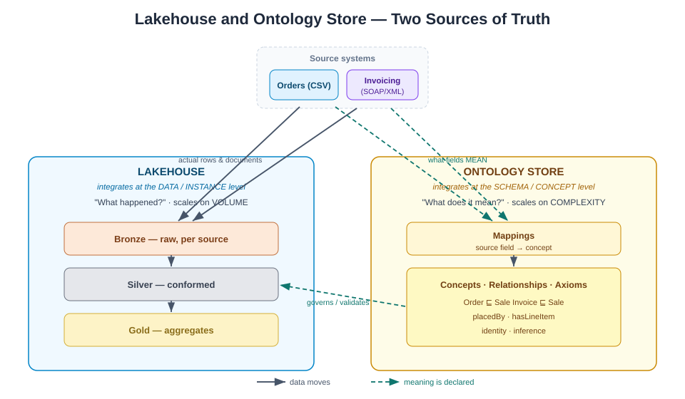
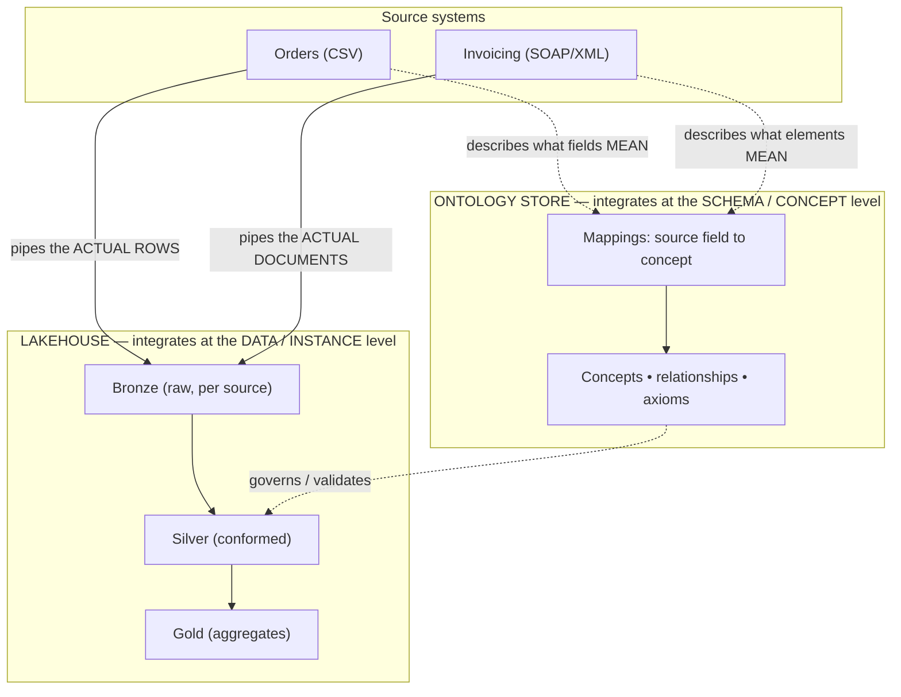

# 07 — Lakehouse and Ontology Store: Two Sources of Truth

> **Why this doc exists:** the earlier docs show *how* data is refined (medallion)
> and *what it means* (ontology). This one steps back to the platform-theory
> question the class asked: **why do we need a lakehouse, why a separate ontology
> store, where do source systems plug in, and why keep the two apart?**

## The big idea: two different "sources of truth"

A modern data platform answers **two fundamentally different questions**, and each
wants a different engine.

| | **Lakehouse** | **Ontology store** |
|---|---|---|
| Answers | "What *happened*?" (the **data**) | "What does it *mean*?" (the **knowledge**) |
| Holds | rows, files, tables, measures | concepts, relationships, rules, identities |
| Unit | a record (`ORD-1042`, `$39.98`) | a class / relationship (`Order ⊑ Sale`, `placedBy`) |
| Scale driver | **volume** (billions of rows, cheap storage) | **complexity** (how things relate & infer) |
| Typical tech | Delta / Iceberg / Parquet on object storage + SQL engine | RDF/OWL triple store or graph DB (SPARQL / Cypher) |
| In this demo | `data/bronze \| silver \| gold` | `ontology/sales-ontology.ttl` |

## 1. Why need a lakehouse?

Because the two older options each fail half the job:

- A **data lake** (raw files, any format) is cheap and flexible but has *no schema,
  no ACID, no fast SQL* — it degrades into a swamp.
- A **data warehouse** (structured, fast SQL) is trustworthy but *rigid and
  expensive*, and chokes on raw / semi-structured data (your XML!).

A **lakehouse** = the lake's cheap, open, any-format storage **+** the warehouse's
schema, ACID transactions, and query performance, in **one** platform. The
medallion pipeline in this project *is* the lakehouse pattern:

- **Bronze** = the lake's superpower: land **anything** (CSV *and* SOAP/XML)
  verbatim, cheaply, with no schema up front.
- **Silver / Gold** = the warehouse's superpower: conformed schema, validation,
  fast aggregates.

**One-liner:** *a lakehouse lets you keep raw XML you don't understand yet AND
serve a trusted revenue report from the same platform.*

## 2. Why need an ontology store?

Because a lakehouse stores **shape**, not **meaning**. Some questions can't be
answered by a schema no matter how clean the tables are:

- *"Is an Order the same kind of thing as an Invoice?"* → needs a **subclass
  axiom** (`Order ⊑ Sale`).
- *"Is customer C007 in the CSV the same entity as `<Customer code='C007'>` in the
  XML?"* → needs **identity / entity resolution**.
- *"If A supplies B and B supplies C, does C depend on A?"* → needs **inference
  over relationships** (transitivity), which SQL joins don't express naturally.

An ontology store keeps **concepts, relationships, rules, and identity** as
first-class, queryable facts (a knowledge graph). Crucially it can **infer** new
facts (revenue is derived; an `Order` *counts as* a `Sale`) rather than only
retrieve stored ones.

**One-liner:** *the lakehouse tells you the numbers; the ontology store tells you
what the numbers are about and how the world connects.*

## 3. Integration points — and at which level

This is the key slide. **The two systems plug into source systems at *different
levels*.**

| Integration | Level | What flows | Where in this project |
|---|---|---|---|
| **Source → Lakehouse** | **Instance / data** | the literal records & files (order rows, XML envelopes) | `bronze_orders.py`, `bronze_invoices.py` |
| **Source → Ontology store** | **Schema / metadata** | the *meaning* of each field (`order_date` ⇒ `Sale.occurredOn`) | [ontology/concept-dictionary.md](../ontology/concept-dictionary.md) mapping table |
| **Ontology → Lakehouse** | **Governance** | axioms that decide valid vs. quarantine; concept names for gold | `silver.py` validation = ontology axioms |

**Rule of thumb:** solid arrows = *data moves*; dotted arrows = *meaning is
declared*. The lakehouse ingests **payloads**; the ontology ingests
**definitions**. They meet at **silver**, where mappings + axioms turn raw
instances into conformed, meaningful facts.

## 4. Benefits of separating the two into distinct systems

1. **Different change rates.** Data arrives every minute; the *meaning* of "a Sale"
   changes maybe once a year. Don't recompute terabytes because you renamed a
   concept — and don't redeploy your ontology because a new CSV landed.
2. **Different scaling axes.** The lakehouse scales on **volume** (columnar files,
   partitions). The ontology scales on **relationship complexity** (graph
   traversal, inference). One engine optimized for both compromises at both.
3. **Reusability / single source of meaning.** One ontology can govern **many**
   lakehouses (plus apps, APIs, BI tools). "Customer" is defined once, not
   re-guessed in every pipeline.
4. **Format-agnostic onboarding.** A new source (JSON, an API) needs only a **new
   mapping** into existing concepts — no change to gold reports. (This is the XML
   demo's moral, generalized.)
5. **Governance & explainability.** "Why was this row rejected?" / "Why do Orders
   and Invoices sum together?" have **declarative** answers in the ontology, not
   answers buried in Python. Auditors read axioms, not code.
6. **Separation of concerns — one level up.** Bronze/silver/gold separates
   *ingestion / quality / business logic*. Lakehouse vs. ontology separates
   *facts / meaning*. Same principle, bigger scope.

## Closing line for the group

> The lakehouse is the **memory** (what happened, cheaply, at scale). The ontology
> store is the **understanding** (what it means, and how it connects). Keep them
> separate so each can do the one thing it's great at — and let them meet at the
> silver layer.

## Related

- [06-ontology.md](06-ontology.md) — the meaning layer in detail
- [02-architecture.md](02-architecture.md) — the lakehouse layers (bronze/silver/gold)
- [ontology/concept-dictionary.md](../ontology/concept-dictionary.md) — the source → concept mappings

---

**Contact:** George Gergues
