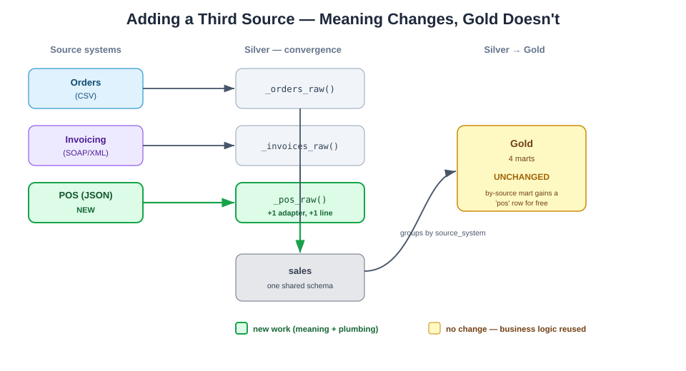
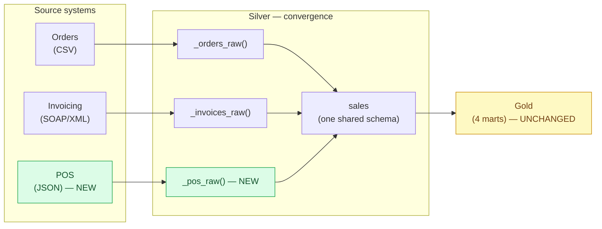

# 08 — Walkthrough: Adding a Third Source (JSON)

> A live exercise that makes the lakehouse-vs-ontology separation concrete.
> We add a **third** source — a JSON REST feed from a point-of-sale (POS)
> system — and watch **which layers change and which stay frozen**.
>
> The headline: you do a little **plumbing** (per-source ingestion) and a little
> **meaning** work (one adapter + one mapping row). **Gold does not change at
> all.** That is the payoff of integrating at silver against a shared ontology.



*Rendered from the Mermaid source below.*



---

## 0. The scenario

Sales are now *also* captured by a POS/marketplace system that exposes a JSON
REST feed. A dropped file looks like this:

```json
{
  "pos_id": "POS-9001",
  "sold_at": "2026-02-14",
  "buyer": { "acct": "C007", "display": "acme retail" },
  "items": [
    { "sku": "Laptop",  "dept": "Electronics", "units": 2, "price": "899.00" },
    { "sku": "Mouse",   "dept": "Accessories", "units": 3, "price": "$19.99" }
  ]
}
```

Same **meaning** as the other two sources — a `Sale`, with a `Customer` and one
or more `LineItem`s — but a **different shape** (nested objects, `price` as a
string with a stray `$`, one document = many line items, like the XML).

---

## 1. Do the *meaning* work first (ontology)

Before touching code, answer the only question that matters: **what does each
JSON field mean?** Add one column to the mapping table in
[../ontology/concept-dictionary.md](../ontology/concept-dictionary.md):

| Concept.property | From ORDERS (CSV) | From INVOICING (XML) | **From POS (JSON) — NEW** |
|---|---|---|---|
| `Sale.sourceSystem` | literal `"orders"` | literal `"invoicing"` | literal `"pos"` |
| `Sale.sourceId` | `order_id` | `Invoice/@id` + `#<line>` | `pos_id` + `#<line ordinal>` |
| `Sale.occurredOn` | `order_date` | `Invoice/@issued` | `sold_at` |
| `Customer.id` | `customer_id` | `Customer/@code` | `buyer.acct` |
| `Customer.name` | `customer_name` | `Customer` text | `buyer.display` |
| `Product.name` | `product` | `Line/@product` | `items[].sku` |
| `Category.name` | `category` | `Line/@category` | `items[].dept` |
| `LineItem.quantity` | `quantity` | `Line/Qty` | `items[].units` |
| `LineItem.unitPrice` | `unit_price` | `Line/Amount` | `items[].price` |

Nothing new was invented — every JSON field lines up with a concept that already
exists. That is the whole point: **the ontology absorbs the new source without
growing.**

In [../ontology/sales-ontology.ttl](../ontology/sales-ontology.ttl) the only
addition is a one-line axiom that ties the new source to the existing `Sale`:

```turtle
:PosSale rdfs:subClassOf :Sale .
```

Because `PosSale ⊑ Sale` (just like `Order` and `Invoice`), gold can total it in
automatically — no gold rule needs to learn about "POS".

---

## 2. Do the *plumbing* (per-source, like every source before it)

This part is mechanical and mirrors the existing two sources.

- **`src/generate_pos.py`** — emit JSON files into `data/landing/pos/`
  (the classroom generator; sprinkle in a few bad rows for the quarantine demo).
- **`src/bronze_pos.py`** — copy each JSON **verbatim** into `bronze/pos/` and
  append a `manifest.csv` row (mirrors `bronze_invoices.py`). Bronze stays
  per-source and lossless — you do **not** flatten the JSON here.

These are new files, not edits to existing ones. Bronze is deliberately
**per-source**, so adding a source never risks the other two.

---

## 3. The real integration: one silver adapter

This is the only genuinely new *meaning-carrying* code. It follows the exact
shape of `_orders_raw()` / `_invoices_raw()` in [../src/silver.py](../src/silver.py) —
read the source, emit **source-neutral raw records** using the mapping from §1:

```python
import json
import bronze_pos  # new per-source bronze reader

def _pos_raw() -> list[dict]:
    """Shred bronze POS JSON into source-neutral raw records."""
    records: list[dict] = []
    for doc, ingested_at in bronze_pos.read_all_bronze():  # (parsed json, ts)
        pos_id = (doc.get("pos_id") or "").strip()
        buyer = doc.get("buyer") or {}
        for ordinal, item in enumerate(doc.get("items", []), start=1):
            records.append({
                "source_system": "pos",
                "source_id": f"{pos_id}#{ordinal}",
                "raw_date": doc.get("sold_at", ""),
                "customer_id": buyer.get("acct", ""),
                "customer_name": buyer.get("display", ""),
                "product": item.get("sku", ""),
                "category": item.get("dept", ""),
                "quantity": item.get("units", ""),
                "unit_price": item.get("price", ""),
                "_ingested_at": ingested_at,
            })
    return records
```

Note what the adapter does **not** do: it does not parse dates, strip the `$`
from `price`, validate quantities, or dedupe. It only **maps shape → shared
vocabulary**. All the cleaning is shared and already exists.

---

## 4. Wire it in — one line

In `build()`, add the new source to the merge. Everything downstream is untouched:

```python
def build() -> tuple[int, int]:
    order_records = _orders_raw()
    invoice_records, xml_files = _invoices_raw()
    pos_records = _pos_raw()                       # <-- new

    records = order_records + invoice_records + pos_records   # <-- + pos_records
    # ...unchanged: _dedupe_latest -> _clean_and_validate -> write sales/quarantine
```

`_dedupe_latest`, `_clean_and_validate`, `_parse_date`, `_parse_price`,
`revenue = quantity × unit_price` — **all reused as-is.** The `$19.99` string and
the `2026-02-14` date are handled by the *same* rules that already clean orders
and invoices. Bad POS rows land in the *same* quarantine with the *same* reasons.

---

## 5. What changed, and what didn't

| Layer | Change to add the JSON source |
|---|---|
| **Ontology** | +1 mapping column, +1 subclass axiom (**meaning**) |
| Landing | new `data/landing/pos/` folder |
| Bronze | **new** `generate_pos.py` + `bronze_pos.py` (per-source plumbing) |
| Silver | **+1 adapter** `_pos_raw()`, **+1 line** in `build()` |
| Silver cleaning/dedupe/validation | **no change** — fully reused |
| **Gold (all 4 marts)** | **no change** — totals, categories, top customers, by-source all just work |

The by-source mart (`gold/revenue_by_source.csv`) will now simply show a third
row (`pos`) *without any code change*, because it groups by whatever
`source_system` values exist in silver.

---

## 6. Verify (the part students run)

After implementing the three new files and the two silver edits:

```pwsh
python run.py --stage all --reset
```

Then confirm:

- [ ] `silver/sales/sales.csv` now contains rows with `source_system = pos`
      **alongside** `orders` and `invoicing`.
- [ ] `gold/revenue_by_source.csv` has a **third** row for `pos` — with **zero**
      edits to `gold.py`.
- [ ] Revenue still ties out: sum of `revenue` in `silver/sales/sales.csv`
      equals the total across the gold marts.
- [ ] A malformed POS row (bad price / zero quantity) appears in
      `silver/_quarantine/rejects.csv` with the *same* reason strings as the
      other sources.

---

## The takeaway

- Adding a source is **mostly plumbing + a little meaning**, and **no** rework of
  business logic.
- The **ontology** grew by a mapping and an axiom — the "meaning" system absorbed
  the change.
- The **lakehouse's** analytical logic (gold) never learned that "POS" exists;
  it only knows `Sale`. Because the new source *is* a `Sale`, it's counted for
  free.

> **New source ⇒ new mapping, not new math.** That is exactly why the lakehouse
> and the ontology store are worth keeping as distinct concerns — and why they
> meet at silver.

See [07-lakehouse-and-ontology-store.md](07-lakehouse-and-ontology-store.md) for
the theory this exercise demonstrates, and
[06-ontology.md](06-ontology.md) for the meaning layer itself.

---

**Contact:** George Gergues
