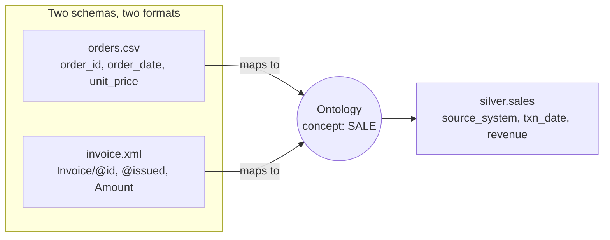
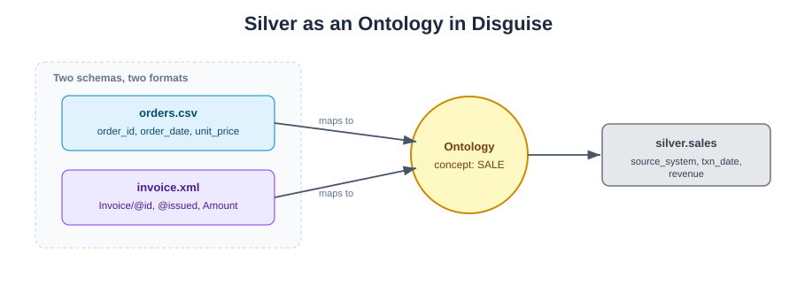
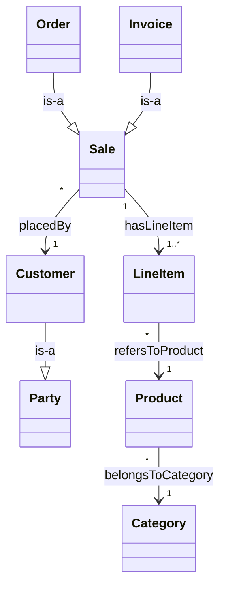
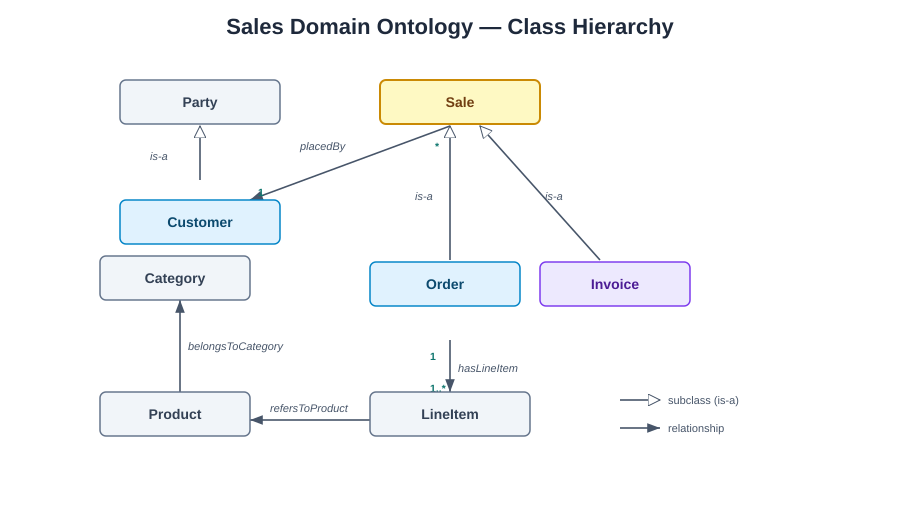

# Ontology — Meaning Layer for the Data Lake (Demo Only)

> ⚠️ **Teaching artifact.** This folder does **not** run as part of the pipeline.
> It exists to introduce the concept of an **ontology** to the class, grounded in
> the exact system they already built (two sources → conformed `silver/sales`).
> The Turtle/OWL file is illustrative, not wired into any triple store.

Your system is already *most of the way* to an ontology and the class won't
realize it. The silver layer's job — "map two schemas into one conformed `sales`
vocabulary" — **is** a proto-ontology. Making that step explicit is the lesson.

## 1. The one-slide definition (anchor it to what they've seen)

| Layer they know | What it answers | Analogy |
|---|---|---|
| **Schema / ERD** ([03-data-model.md](../architecture/03-data-model.md)) | "How is data *stored*?" (columns, tables, keys) | The **filing cabinet** |
| **Ontology** | "What does the business *mean*?" (concepts, relationships, rules) — independent of storage or format | The **dictionary + rulebook** |

Key line for the group: *"An ERD describes tables. An ontology describes the
world the tables are trying to represent."* A schema changes when you switch from
CSV to XML; the ontology does **not**.

## 2. The hook: your silver layer is an ontology in disguise

Show them the convergence they already built:

Both `order_date` and `Invoice/@issued` mean the **same concept**: *the date a
Sale occurred*. The ontology is the agreement that says so. The
`_orders_raw()` / `_invoices_raw()` adapters in `src/silver.py` are literally
**ontology mappings** — just written in Python instead of declared.

## 3. The domain ontology (built from YOUR entities)

Classes (concepts), not tables:

Two big teaching payoffs:

- **`Order` and `Invoice` are both a kind of `Sale`.** That subsumption (`is-a`)
  is what lets one gold query total revenue across both systems. The ontology
  *justifies* the union you do in silver.
- **A concept ≠ a source.** "Customer C007" is one real-world entity even though
  it appears in a CSV row *and* an XML `<Customer code="C007">`. The ontology
  gives it a single identity.

## 4. Three vocabularies an ontology adds (that a schema can't say)

1. **Classes & subclasses** — `Order ⊑ Sale`, `Customer ⊑ Party`.
2. **Object properties (relationships with meaning)** — `placedBy`,
   `refersToProduct`, `belongsToCategory`, each with domain/range and cardinality.
3. **Axioms / rules** — e.g. *"every Sale has exactly one Customer,"* *"quantity
   must be a positive integer,"* *"revenue = quantity × unit_price."* Notice:
   **those are your silver validation rules.** Reframe them as ontology axioms and
   the class sees that data quality = ontology conformance.

## 5. How to represent it concretely (two fidelities, both included)

- **Lightweight (best for this class):** [concept-dictionary.md](concept-dictionary.md)
  — a glossary of Term → Definition → maps-from (orders field / invoice XPath) →
  rule. Reads like a business dictionary.
- **Formal (show one slide):** [sales-ontology.ttl](sales-ontology.ttl) — a short
  **Turtle/OWL** file so they see the "real" thing (classes, subclass axioms,
  object/data properties, cardinality restrictions).

## 6. The punchline that ties the whole course together

> Bronze keeps bytes. Silver conforms **schemas**. The **ontology** conforms
> **meaning** — and it's the reason a brand-new SOAP/XML system could join the
> lake without breaking a single gold report.

Same "format-agnostic" moral as the XML demo, elevated one level: *agree on
concepts, and the storage format stops mattering.*

## Files in this folder

| File | Purpose |
|---|---|
| [README.md](README.md) | This overview + teaching narrative |
| [concept-dictionary.md](concept-dictionary.md) | Plain-language glossary with source mappings and rules |
| [sales-ontology.ttl](sales-ontology.ttl) | Formal OWL/Turtle sketch of the same ontology |

See also: [architecture/06-ontology.md](../architecture/06-ontology.md) for how
the ontology fits the medallion layers.

---
*For teaching/demo purposes only. The `.ttl` is a sketch — namespaces and axioms
are illustrative and not loaded by the pipeline.*

---

**Contact:** George Gergues
